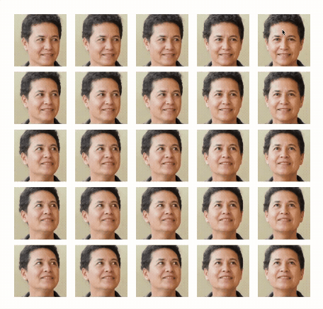

# LivePic

LivePic turns a single portrait into an interactive, gaze‑tracking sprite and a reusable `<live-pic>` web component.



## Use the `<live-pic>` web component

- Install the package (for bundlers / ESM import):

  ```
  npm install livepic
  ```

- Import the LivePic component:

  ```js
  import { LivePic } from 'livepic';
  ```

  This registers the `<live-pic>` custom element for use.

- Add to your markup (point to your sprite sheet):
  ```html
  <live-pic spriteSrc="/output/AvatarSprite.webp" gridSize="15" size="150"></live-pic>
  ```
- Attributes:
  - `spriteSrc` (required): URL/path to the sprite sheet.
  - `gridSize` (number, default `5`): Frames per side of the sprite grid (e.g., `gridSize="3"` for a 3x3 sprite).
  - `size` (number, default `160`): Component width/height in px.
  - `fps` (number, default `30`): Max frame updates per second.
- Behavior: tracks mouse/touch, picks the right frame from the sprite, pauses when offscreen or when the document is hidden, assumes a square aspect ratio (wrap it with your own styles as needed).

### Load from unpkg

- Drop a single module script to register the custom element globally:

  ```html
  <script type="module" src="https://unpkg.com/livepic@latest"></script>
  ```

- Then use the tag in your markup as normal:

  ```html
  <live-pic
    spriteSrc="https://example.com/output/AvatarSprite.webp"
    gridSize="15"
    size="150"
  ></live-pic>
  ```

## Generate your own sprite with the CLI

Use this if you need to produce `AvatarSprite.webp` and `sprite.json` from a source photo.

### Get ready

- Install deps and build once: `npm install && npm run build`
- Add your Replicate API token to `.env`:
  ```
  REPLICATE_API_TOKEN=your-token
  ```
- Place your source photo at `input/photo.jpeg` (JPEG/PNG; HEIC is not supported).
- For sprite assembly, ensure ImageMagick `montage` is on your PATH.

### Generate frames and sprite

- Run from the project root:

  ```
  npx livepic generate [gridSize] [--skip-sprite]
  ```

  - `gridSize` must be a positive odd integer (default `5`); `5x5` produces 25 frames.
  - Prompts confirm Replicate spend and sprite build. Set `LIVEPIC_AUTO_CONFIRM=1` in CI to auto-accept.
  - `--skip-sprite` (or `LIVEPIC_SKIP_SPRITE=1`) skips sprite assembly.
  - Uses the Replicate model `fofr/expression-editor` under the hood: https://replicate.com/fofr/expression-editor

- Output:
  - Frames: `output/avatar_*.webp`
  - Sprite: `output/AvatarSprite.webp`
  - Metadata: `output/sprite.json` (grid size and cell size)

### Preview locally

- After generating and building, start the preview server from the project root:

  ```
  npx livepic preview [port]
  ```

  - Default port: `3000`; auto-opens your browser.
  - Expects `output/AvatarSprite.webp` and `output/sprite.json` in the current working directory.
  - Serves `dist/index.js`; rerun `npm run build` after code changes.

## Project scripts

- `npm run build` — compile TypeScript to `dist/`
- `npm run dev` — watch mode for development
- `npm test` / `npm run test:run` / `npm run coverage` — Vitest
- `npm run lint` / `npm run lint:fix` — ESLint
- `npm run format` / `npm run format:check` — Prettier

## What to remember

- The web component only needs a sprite sheet and matching `gridSize`; import and use it directly.
- To produce that sprite yourself, set `REPLICATE_API_TOKEN`, place `input/photo.jpeg`, and run the generate command.
- Ensure ImageMagick’s `montage` is available if you want the sprite sheet.

## Acknowledgements

- Gaze-tracking idea inspired by https://github.com/kylan02/face_looker
