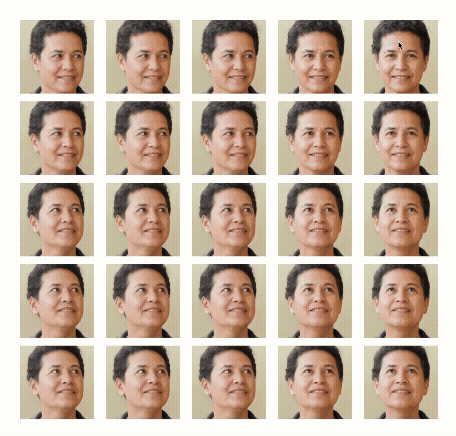

# LivePic

LivePic turns a single portrait into an interactive, gaze‑tracking sprite and a reusable `<live-pic>` web component.

[](https://reoberon.github.io/livepic/ShowCase)

## Use the `<live-pic>` web component

- Install the package:

  ```
  npm install livepic
  ```

- If you want the `<live-pic>` element to be registered immediately, import the browser entry:

  ```js
  import 'livepic/browser';
  ```

- Then add the element to your markup:

  ```html
  <live-pic sprite="/output/AvatarSprite.webp" gridSize="15" size="150"></live-pic>
  ```

- If you want to choose the tag name or register later, use the root entry:

  ```js
  import { defineLivePic, LivePic } from 'livepic';

  defineLivePic();
  ```

  The root entry exports the class and `defineLivePic()` without side effects.

- To create and configure an element programmatically, use `createLivePic()`. It uses the
  tag registered with `defineLivePic()`, or registers the default `<live-pic>` tag if no tag
  has been registered yet. It returns a disconnected element that you can insert into the
  document:

  ```js
  import { createLivePic } from 'livepic';

  const livePic = createLivePic({
    sprite: '/output/AvatarSprite.webp',
    placeholder: '/output/LoadingPlaceholder.jpeg',
    gridSize: 15,
    size: 150,
  });

  document.querySelector('#gallery').append(livePic);
  ```

- Pass a custom tag name if you do not want to use `<live-pic>`:

  ```js
  import { defineLivePic } from 'livepic';

  defineLivePic('interactive-portrait');
  ```

  Subsequent `createLivePic()` calls create `<interactive-portrait>` elements. Register
  the custom tag before calling the factory; importing `livepic/browser` automatically
  registers the default tag.

  Calling `defineLivePic()` again with the same tag is safe. Once registered, the tag
  cannot be changed: requesting another name throws an error. Calling `defineLivePic()`
  without an argument requests the default `live-pic` tag.

  ```html
  <interactive-portrait
    sprite="/output/AvatarSprite.webp"
    gridSize="15"
    size="150"
  ></interactive-portrait>
  ```

- Attributes:
  - `sprite`\* (string, required): URL/path to the sprite sheet.
  - `spriteSrc` alias for `sprite` attribute.
  - `placeholder` (string): URL/path to a low-res/loading image to show while the sprite loads.
  - `gridSize` (odd integer, minimum `3`, default `5`): Frames per side of the sprite grid (e.g., `gridSize="3"` for a 3x3 sprite).
  - `size` (positive integer, default `160`): Component width/height in px.
  - `fps` (positive number, default `30`): Max frame updates per second.
  - `layoutTracking` (`static` or `frame`, default `static`): Set to `frame` when the element moves independently of scroll/resize, such as during CSS transforms or drag animations. This refreshes geometry every active frame.
- Behavior: tracks mouse/touch, picks the right frame from the sprite, pauses when offscreen or when the document is hidden, assumes a square aspect ratio (wrap it with your own styles as needed).

### Grid compatibility and migration from v1.3.0

**Breaking change:** `gridSize` must now be an odd integer of at least `3` in both
the web component and the CLI. The component no longer accepts even grids, including
third-party 4x4 sprites previously accepted in v1.3.0. Both the component and the CLI
now reject `gridSize=1`.

Even-sized sprite grids were never intended to be supported and were not tested.
Explicit support could be implemented in a future release if there is demand, but
it is not currently planned or guaranteed.

Regenerate or replace affected sprites with a compatible grid, such as 3x3 or 5x5,
and set `gridSize` to match the actual number of frames per side. Changing the
attribute alone does not convert an existing sprite sheet. When using the CLI
preview, ensure that `sprite.json` also describes the replacement sprite correctly.

### Load Directly In The Browser

- Drop a single module script to register the custom element globally:

  ```html
  <script type="module" src="https://unpkg.com/livepic@latest"></script>
  ```

- Then use the tag in your markup as normal:

  ```html
  <live-pic sprite="/AvatarSprite.webp" gridSize="15" size="150"></live-pic>
  ```

## Generate your own sprite with the CLI

You can also use the `generate` script to create frames with the Replicate AI model and assemble a ready‑to‑use `AvatarSprite.webp` from a source photo.

### Get ready

- Install the LivePic package: `npm install livepic`
- Add your Replicate API token to `.env`:
  ```
  REPLICATE_API_TOKEN=your-token
  ```
- Optional: override the Replicate model version via `.env`: `LIVEPIC_MODEL_VERSION=<version-id>`
- Place your source photo at `input/photo.jpeg` (JPEG/PNG; HEIC is not supported).
- For sprite assembly, ensure ImageMagick `montage` is on your PATH.

### Generate frames and sprite

- Run from the project root:

  ```
  npx livepic generate [gridSize] [--skip-sprite]
  ```

  - `gridSize` must be an odd integer, minimum `3` (default `5`); `5x5` produces 25 frames.
  - Prompts confirm Replicate spend and sprite build. Set `LIVEPIC_AUTO_CONFIRM=1` in CI to auto-accept.
  - `--skip-sprite` (or `LIVEPIC_SKIP_SPRITE=1`) skips sprite assembly.
  - Uses the Replicate model `fofr/expression-editor` under the hood: https://replicate.com/fofr/expression-editor

- Output:
  - Frames: `output/avatar_*.webp`
  - Sprite: `output/AvatarSprite.webp`
  - Metadata: `output/sprite.json` (contains gridSize and pictureSize properties. Useful for preview command.)

### Preview locally

- After generating and building, you can start the preview server using the CLI:

  ```
  npx livepic preview [port]
  npx livepic preview -g <gridSize> -s <pictureSize> -p <port>
  ```

  Arguments:
  - `gridSize` (`-g`, `--grid-size`) - number of pictures per side in a sprite; must be an odd integer, minimum `3` (use `5` for a `5x5` sprite). If not provided, it is read from `sprite.json` and validated using the same rules.
  - `pictureSize` (`-s`, `--picture-size`) - size of the component in pixels. If not provided, it is read from `sprite.json`.
  - `port` (`-p`, `--port`) - port to run the preview server. Default: `3000`; auto-opens your browser. If you provide a single positional argument, it is treated as the port for convenience.
  - Expects `output/AvatarSprite.webp` and `output/sprite.json` in the current working directory.

## What to remember

- The web component only needs a sprite sheet and matching `gridSize`; import and use it directly.
- To produce that sprite yourself, set `REPLICATE_API_TOKEN`, place `input/photo.jpeg`, and run the generate command.
- Ensure ImageMagick’s `montage` is available if you want the sprite sheet.

## Development

The project uses pnpm 10. Install dependencies and run the checks with:

```sh
pnpm install
pnpm run test:run
pnpm run lint
pnpm run format:check
```

`pnpm run test:run` runs unit tests, builds the package, and runs smoke tests against
the fresh build. No existing `dist` directory is required.

- `pnpm test` watches unit tests without building the package.
- `pnpm run test:unit` runs unit tests once without building the package.
- `pnpm run test:smoke` builds the package and runs smoke tests.
- `pnpm run coverage` measures unit-test coverage without building the package;
  smoke tests are excluded.

## Acknowledgements

- Gaze-tracking idea inspired by https://github.com/kylan02/face_looker
